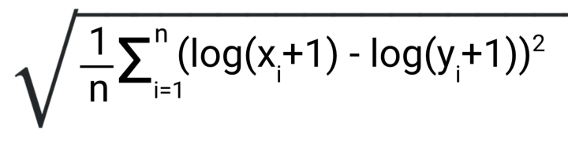
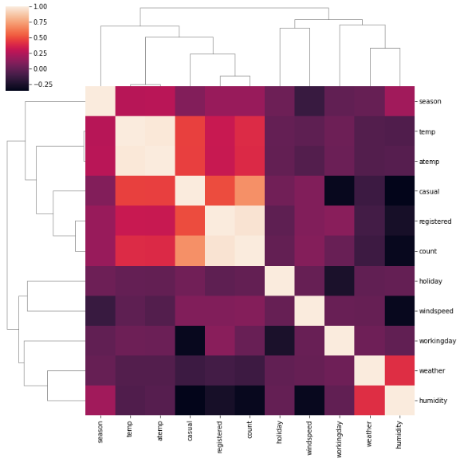
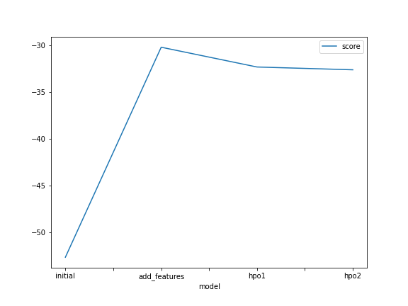
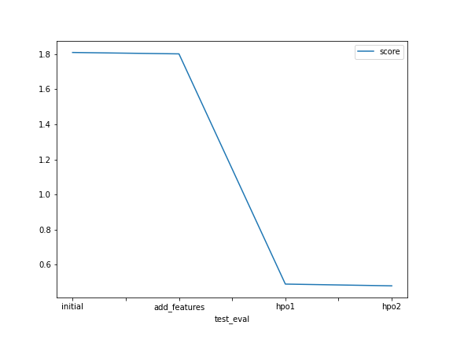

# Report: Predict Bike Sharing Demand with AutoGluon Solution
#### Asmaa Hanine

## Initial Training
### What did you realize when you tried to submit your predictions? What changes were needed to the output of the predictor to submit your results?
In order to have acceptable predictions, I had to replace negative predictions by zero before submitting them. The reason behind this is that the score used to evaluate the predictions is the RMSLE : Root Mean Squared Logarithmic Error which is defined only for values that are greater or equal to zero. 
Below is the formula of the RMSLE.

### What was the top ranked model that performed?
The top ranked model is the weighted ensemble model. In fact, ensemble models are comprised of many weak learners having different logics, then a weighted algorithm is applied to combine the predictions of the models. This diversification of prediction model allows to minimize the prediction error.

## Exploratory data analysis and feature creation
### What did the exploratory analysis find and how did you add additional features?

#### Correlation matrix
We can deduce from the correlation matrix below that the temp and atemp parameters are highly correlated. The link between both features is evident. The higher the temperature the higher the felt temperature is.In the next steps we may want to only keep one parameter as keeping both would imply duplicating information. Other correlations are not as high.

#### Pairplot
We can deduce from the portion of pairplot below a few things :
- During the fall season, the use of bikes is higher than other seasons. The least amount of rentals have been recorded during the summer.
- More rentals happen during working days than holidays or other non working days, this can be explained by the fact that people rent bikes to go to work.
- More rentals are recorded when the sky is clear or mildly cloudy.
- Humidity is not a very determining factor when it comes to bike rentals, as the count of rentals doesn't vary much as a function of humidity.
- Rentals tend to be higher for felt temperatures and recorded temperatures between 25 and 35 degrees.
- For windspeeds above 40 we have a low count of rentals. High amounts of rentals have been recorded for windspeeds under 30m/s.
- There is a high correlation between registered rentals and total number of rentals, as it is more easy to track registered rentals in comparison to casual rentals.

#### Count timeseries plot 
The plot of counted rentals timeseries below shows that the number of rentals increased from 2011 to 2013. We can also notice that within the same season, the number of rentals varies depending on the month. It would be interesting to add time features extracted from the dateime to the dataset to gain more insight on rental count variation for different granularity levels of time.

#### Datetime column features extraction 
From the plots below, we can notice that more bikes are rented at 08am and 5pm, which correspond to the start and end of work day hours.

### How much better did your model preform after adding additional features and why do you think that is?
The rmsle dropped from 1,809 to 1.801. Adding features did not highly impact the kaggle score. This can be explained by the fact that the new features did not add a lot of new information. Thus the need to tune the hyperparameters of the model.

## Hyper parameter tuning
### How much better did your model preform after trying different hyper parameters?
The rmsle dropped from 1.801 to 0.49 after setting the hyperparameter to 'default' and the hyperparameter_tune_kwargs to auto'. 
Then the rmsle went down by 0.01 after specifying the parameters for underlying models. This is the biggest drop of rmsle recorded.

### If you were given more time with this dataset, where do you think you would spend more time?
If I were given more time, I would spend more time on EDA and data transformation. In fact, the data is not centered, so I would normalize it and see the impact of normalization on the output. I would also finetune the model by testing more model hyperparameters other than the XGboost and LGBM parameters. I would also implement another algorithm to compare its performance to that of autogluon.

### Create a table with the models you ran, the hyperparameters modified, and the kaggle score.
|model|time_limit|presets|hyperparameters|hyperparameter_tune_kwargs|score|
|--|--|--|--|--|--|
|initial|600|best_quality|default|-|1.81|
|add_features|600|best_quality|default|auto|0.49|
|hpo|600|best_quality|{'GBM': gbm_config,'XGB': xgb_config}	|{'searcher':'auto'}|0.48|

### Create a line plot showing the top model score for the three (or more) training runs during the project.

Below is the line plot showing the top model scores for the runs of the project :

### Create a line plot showing the top kaggle score for the three (or more) prediction submissions during the project.

Below are the different kaggle scores of the runs :

## Summary
In this project, I first started by an exploratory data analysis which allowed to gain insight on the data and create new features. Then I implemented a bike sharing demand prediction model using autogluon, which I then finetuned. The score has improved through adding new features and the hyperparameter optimization and can be further improved through more hyperparameter tuning.
